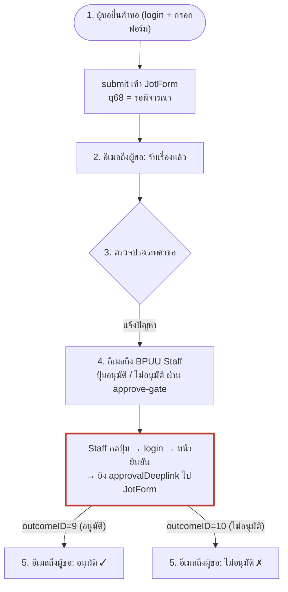

# BPUU Workflow — บันทึก Flow ทั้งหมด

ไฟล์นี้บันทึกการเดิน flow จริงของแต่ละประเภทคำขอ ตามที่ตั้งไว้ใน **JotForm Approval
Workflow** (ตัดสินใจ 2026-08-27: ใช้ workflow ของ JotForm เต็มรูปแบบ — อีเมลออก
อัตโนมัติทั้งสาย ระบบของเราทำหน้าที่ฟอร์มหน้าบ้าน + login gate + approve-gate)
เปิดตรวจแบบเห็นภาพได้ที่ `docs/flows-viewer.html` (server `bpuudemo-docs` พอร์ต 8924)

**approve-gate: แก้ได้แล้ว ✅ (ยืนยัน end-to-end 2026-08-27)** — เดิม Staff กดปุ่มแล้ว
JotForm ไม่บันทึกผล workflow ไม่เดิน ตอนนี้ทำงานครบ flow: task ปิดจริง, audit บันทึก,
q68 ขยับเป็น "อนุมัติแล้ว" รายละเอียดวิธีแก้ดูหัวข้อ Flow 1 ด้านล่าง

**ต้นตอ + ทางแก้ (พิสูจน์แล้ว 2026-08-27):**
- deeplink ไป resolve เป็นหน้าฟอร์มพิจารณาของ JotForm เอง (`/approval-form/...`)
  ที่มีปุ่ม outcome รอให้คนกด Submit — การ GET เฉย ๆ ไม่บันทึกผล
- **iframe ซ่อน** (ของเดิม): โหลดหน้านั้นสำเร็จแล้วรายงานอนุมัติ = false positive มาตลอด
- **server POST เอง**: ติด captcha ("Please Complete") — ทำไม่ได้
- **iframe deeplink ตรง ๆ**: จอเปล่า — แต่ต้นเหตุคือ redirect chain ของ deeplink ไม่ใช่
  ตัวหน้าฟอร์ม (หน้า `/approval-form/...` ตัวสุดท้าย ฝัง iframe ได้ปกติ! ยืนยันใน browser)
- **ทางแก้ที่ใช้:** server resolve deeplink → URL `/approval-form` ตัวสุดท้ายก่อน แล้ว
  ฝังใน **iframe ที่มองเห็นได้ในหน้า gate** (ไม่เปิดแท็บใหม่ → address bar ไม่โผล่ URL
  JotForm ให้ copy) staff กด Submit ในกรอบ → gate poll `/api/approve-gate/task-state`
  จน task ปิด (ปุ่มหาย) จึงบันทึก decision guard + ขึ้นผลสำเร็จ ไม่มี false positive
  เพราะความสำเร็จมาจากการยืนยันฝั่ง server ว่า task ปิดจริง
- ข้อจำกัดที่เหลือ: URL (มี access-token) อยู่ใน iframe src → เปิด devtools ก็ยังดึงได้
  (แต่ดีกว่า address bar มาก) — zero-leak ต้อง full proxy ซึ่ง captcha ของ JotForm
  ผูก domain ทำไม่ได้
- **ยังไม่ยืนยัน:** กด Submit ในเฟรม (คนจริงในเบราว์เซอร์) ผ่าน captcha ไหม — server POST
  ติด แต่เบราว์เซอร์จริงรัน JS ของ JotForm เอง น่าจะผ่าน (ต้องให้ผู้ใช้เทสจริง)

---

## Flow 1: แจ้งปัญหา (แจ้งปัญหาการใช้งานพื้นที่/ที่จอดรถ)

**สถานะ:** บันทึกจากเจ้าของระบบ 2026-08-27 — flow ที่ง่ายที่สุด มีผู้พิจารณาขั้นเดียวคือ BPUU Staff

### ขั้นตอน

1. ผู้ขอยื่นคำขอผ่านฟอร์มหน้าเว็บ (login แล้ว) → submit เข้า JotForm
2. ระบบส่งอีเมลแจ้งผู้ขอว่า **รับเรื่องแล้ว** — template: `flow-emails/ack-received.html` (สถานะในอีเมล: รอการตรวจสอบ)
3. workflow ตรวจประเภทคำขอ → พบว่าเป็น **แจ้งปัญหา**
4. ระบบส่งอีเมลถึง **BPUU Staff** ให้พิจารณาผ่าน approve-gate — template: `flow-emails/staff-approval-request.html` (มีรายละเอียดคำขอ + เอกสารแนบ + ปุ่มอนุมัติ/ไม่อนุมัติ)
5. ระบบส่งอีเมลแจ้ง**ผล**กลับไปหาผู้ขอ — ฉบับอนุมัติ: `flow-emails/result-approved.html` (ฉบับไม่อนุมัติยังไม่ได้บันทึกเข้า repo)

### Flowchart

โหนดกรอบแดง = จุดที่พังตอนนี้ (JotForm ไม่รับผลจาก deeplink ที่ยิงผ่าน gate)

### อีเมลใน flow นี้

| ขั้น | ถึง | badge | template | merge fields ที่ใช้ |
|---|---|---|---|---|
| 2 | ผู้ขอ | รับเรื่องแล้ว | `flow-emails/ack-received.html` | `{input19}` `{input15}` `{id}` |
| 4 | BPUU Staff | ต้องดำเนินการ | `flow-emails/staff-approval-request.html` | `{id}` `{input19}` `{input15}` `{input33}` `{summary}` `{approvalDeeplink}` |
| 5 | ผู้ขอ | อนุมัติแล้ว | `flow-emails/result-approved.html` | `{input19}` `{input15}` `{id}` |

### ปุ่มพิจารณาใน approve-gate

- อนุมัติ: `https://bpuu-service-uat.kmutt.ac.th/approve-gate?id={id}&outcome=accept&target={approvalDeeplink}?outcomeID=9`
- ไม่อนุมัติ: `https://bpuu-service-uat.kmutt.ac.th/approve-gate?id={id}&outcome=reject&target={approvalDeeplink}?outcomeID=10`

ข้อควรระวังที่รู้แล้ว:

- **outcomeID ของ flow นี้: 9 = อนุมัติ, 10 = ไม่อนุมัติ** (ผูกกับ node พิจารณาของ BPUU Staff ใน JotForm workflow)
- `target` ต้องเป็น query param **ตัวสุดท้าย**เสมอ — server อ่านจาก raw URL ด้วย `extractRawTarget()` เพราะ deeplink ของ JotForm มี `&redirect=...` ซ้อนอยู่ข้างใน
- base URL ในอีเมลฝังเป็น **UAT** (`bpuu-service-uat.kmutt.ac.th`) — ขึ้น PROD ต้องตามแก้ template ในตัว JotForm workflow ด้วย
- **q68 gate เป็นคนเขียนเอง** (JotForm workflow ไม่เขียนให้ — ยืนยันแล้ว q68 ค้าง `รอพิจารณา` หลังอนุมัติ): หลัง gate ยืนยันว่า task ปิดจริง จะยิง `POST /submission/{id}` เขียน q68 ตาม outcome — accept→`อนุมัติแล้ว`, reject→`ไม่อนุมัติ` (map ที่ `outcomeToQ68Status()`) เป็น best-effort ถ้าเขียนพลาดไม่ถือว่าอนุมัติล้มเหลว
- **multi-step flows ระวัง:** flow แจ้งปัญหามีขั้นเดียว accept = จบ = `อนุมัติแล้ว` ถูกต้อง แต่ flow ที่มีหลายขั้น (จอดรถ: หัวหน้าหน่วยงาน→BPUU) การ accept ขั้นแรกไม่ควรเขียน `อนุมัติแล้ว` เลย — พอถึง flow พวกนั้นต้องส่งสถานะที่ต้องการมากับลิงก์แทน map default

---

## Flow 2 เป็นต้นไป

_(ยังไม่บันทึก — จะเพิ่มทีละ flow)_
